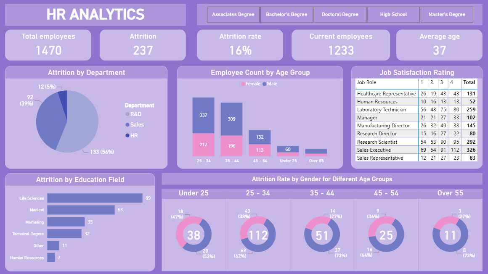

# HR Analytics Dashboard

This project presents an HR analytics dashboard built in Power BI to explore workforce composition, attrition patterns, and employee demographics.

The dashboard focuses on transforming HR data into clear, actionable insights that support better workforce planning and retention decisions.

---

## Project Overview

The dashboard includes key HR metrics and visual analysis such as:

- Total and current headcount
- Attrition count and attrition rate
- Workforce age distribution
- Attrition by department and education field
- Job satisfaction analysis across roles
- Gender-based attrition patterns across age groups

---

## Tools Used

- Power BI
- Data modeling and transformation
- HR KPI design
- Data visualization & storytelling

---

## Dashboard Preview

---

## Key Insights

- Attrition is concentrated in specific departments, highlighting potential retention risks
- Mid-career employees (25–44) show notable attrition patterns
- Workforce demographics reveal differences in attrition across education fields and age groups

