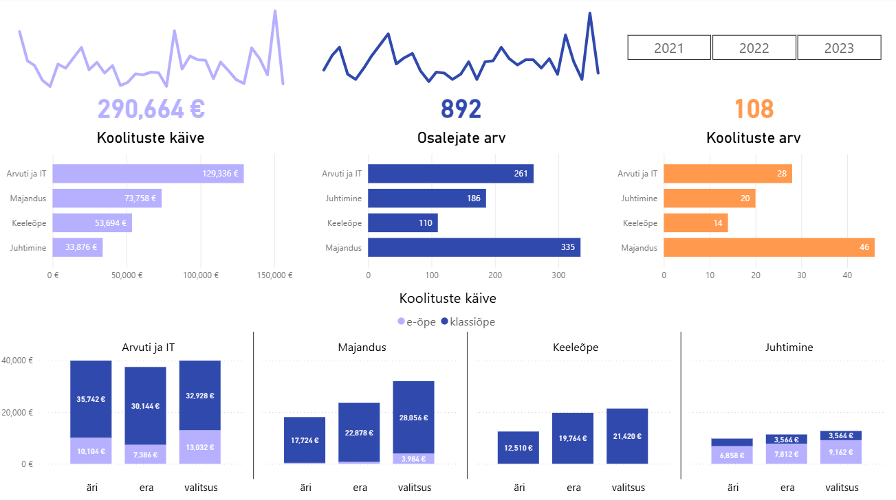

# Data Analysis Portfolio — Mirjam Riivald

Welcome to my data analytics portfolio.

This repository showcases my practical work in **SQL-based data analysis**, where I explore real-world style business questions and transform raw datasets into meaningful insights.

I am currently developing my skills as an aspiring **Junior Data Analyst**, focusing on analytical thinking, clean query structure, and trend interpretation.

---

## Skills

* SQL & relational database fundamentals
* Data aggregation and trend analysis
* Window functions and analytical querying
* Business-focused problem solving
* Data exploration and insight generation

---

## Projects

### 🔹 Pharmacy Market Trend Analysis (SQL)

This project analyzes pharmacy market dynamics using structured SQL queries and business-driven analytical questions.

**Key questions explored:**

* Trends in pharmacy openings and closures over time
* Whether closures disproportionately affect certain pharmacy sizes
* Implications for healthcare accessibility
* Relationship between distance sellers and physical pharmacies

The project includes both the dataset and analytical SQL queries.

---

### 🔹 Course Analytics Dashboard (Power BI)

An interactive Power BI dashboard analyzing course participation, revenue distribution, trainer workload, and geographic patterns.

The project demonstrates data modeling, KPI design, and business insight generation using structured relational datasets.

📸 **Preview**

**View project:**
[Course Analytics Dashboard](Training_Dashboard_PowerBI)

---

## Work in Progress

This portfolio will continue expanding with additional SQL analyses, Power BI dashboards, and ETL projects as I progress in my data analytics journey.

---

## Contact

[LinkedIn — Mirjam Riivald](https://www.linkedin.com/in/mirjam-riivald-033a3a266)

