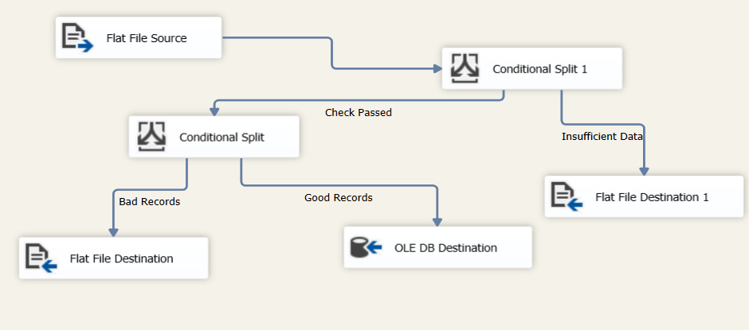
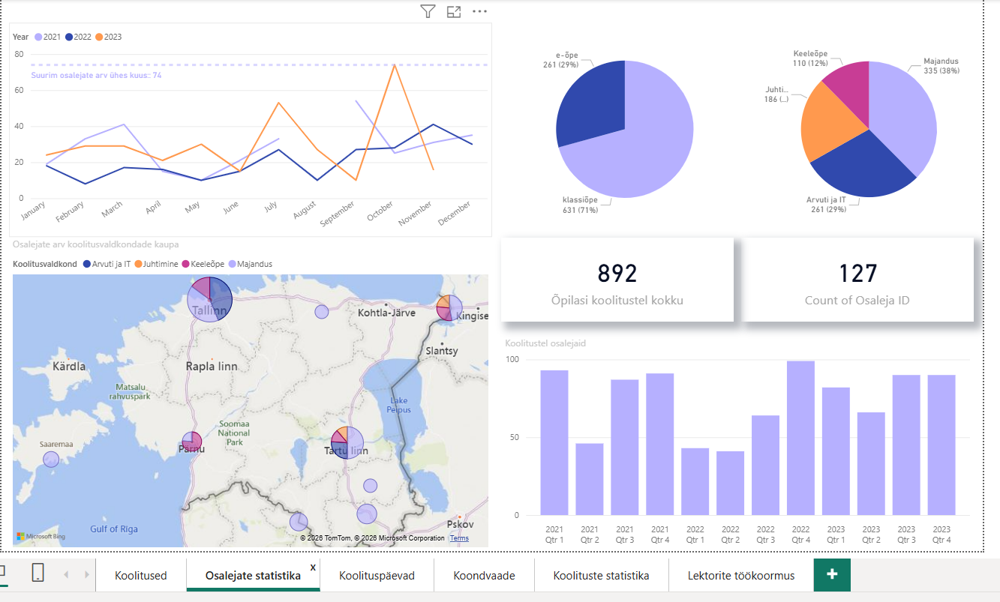

# 📊 Data Analysis Portfolio — Mirjam Riivald

Welcome to my data analytics portfolio.  
This repository documents my learning journey and practical projects in SQL, Excel, Power BI, and ETL.

I am currently building my skills as an aspiring Junior Data Analyst and continuously adding new projects.

---

## 🛠 Skills

- SQL & database fundamentals
- Excel data analysis (correlation, histograms, data cleaning)
- Power Query & Power BI visualization
- ETL basics (SSIS)
- Data quality validation

---

## 📂 Projects

### 🔹 ETL Data Validation Project (SSIS)
- Built an ETL pipeline importing CSV data into SQL Server
- Implemented Conditional Split for data quality validation
- Separated good, insufficient, and bad records
- Applied structured error handling

<i>SSIS ETL pipeline with data validation and Conditional Split logic (FakeNames_SQL_Project)</i>

### 🔹 Survey Data Analysis Project
- Designed and analyzed a survey
- Performed correlation analysis and created histograms in Excel
- Built Power BI dashboards and presented insights

---

## 🚧 Work in Progress

New projects and files will be added regularly as I continue learning and improving my data analytics skills.

---

## Power BI Training Analysis – Preview

---

## 📬 Contact

LinkedIn: www.linkedin.com/in/mirjam-riivald-033a3a266  
